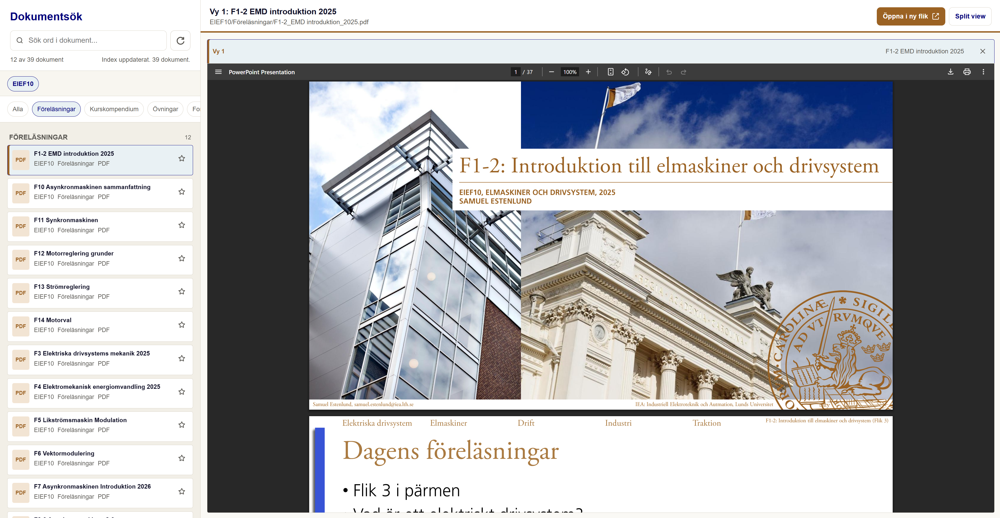

# Dokumentsök

Lokalt dokumentverktyg för att söka i kursmaterial. Appen bygger ett sökindex av dokumentmapparna, startar en lokal server och visar dokumenten i en snabb webbaserad läsvy.

## Exempel på appen



## Requirements

För att köra programmet behövs:

- Windows 10 eller 11 om du använder `start.bat`
- Python 3 installerat. Ladda ner från [python.org/downloads/windows](https://www.python.org/downloads/windows/)
- `python` eller `python3` måste fungera i `PATH`, eller så måste Python finnas på `%USERPROFILE%\miniconda3\python.exe`. Om du installerar från python.org, se till att Python läggs till i `PATH` under installationen.
- Python-paketet `pypdf`
- En modern webbläsare

Valfritt, bara för OCR av skannade PDF:er och bilder:

- Antingen `Tesseract OCR` + `Poppler` med `pdftoppm`
- Eller Python-paketen `rapidocr-onnxruntime` och `pymupdf`
- Python-paketet `Pillow`
- Om du använder Tesseract-vägen måste `tesseract` och `pdftoppm` kunna hittas i `PATH`

## Installation

Installera minsta nödvändiga Python-paket:

```bash
python -m pip install pypdf
```

Om du vill ha OCR-stöd också:

```bash
python -m pip install pytesseract pdf2image Pillow
```

Om du vill använda OCR utan separat systeminstallation av Tesseract:

```bash
python -m pip install rapidocr-onnxruntime pymupdf Pillow
```

Om du vill använda Tesseract-vägen behöver du även installera Tesseract och Poppler separat och se till att deras kommandon finns i `PATH`.

I Windows betyder det att dessa kommandon ska fungera:

```bat
where tesseract
where pdftoppm
```

Vanliga installationsmappar som `start.bat` redan försöker använda om de finns:

- `C:\Program Files\Tesseract-OCR`
- `C:\Program Files\poppler\Library\bin`

## Snabbstart

Kör från projektroten.

I Windows:

```bat
start.bat
```

Om du kör via Bash i stället:

```bash
bash start.sh
```

Scriptet bygger om sökindexet, startar en lokal server och öppnar:

```text
http://127.0.0.1:<port>/app/index.html
```

Stoppa servern med `Ctrl+C` i terminalen.

## Mappstruktur

```text
app/       Webbappen och search-index.json
EIEF10/    Kursmapp med dokument sorterade per kategori
start.bat  Startscript för Windows
start.sh   Startscript för Bash
```

Kursmappar ligger på toppnivån. Just nu finns `EIEF10`, men fler kurser kan läggas till senare på samma nivå.

Exempel:

```text
Reglerteknik/
  00_Föreläsningar/
  01_Tentor/
  02_Formelblad/
```

Kategorier upptäcks automatiskt från mapparna. Om du vill styra ordningen i appen kan du lägga numeriska prefix på kategorimapparna, till exempel `00_Föreläsningar`. Prefixet används för sortering men visas inte i kategorinamnet.

## Funktioner

- Automatisk indexering av dokument när appen startas.
- Refresh-knapp i sökraden för att uppdatera index utan att starta om appen.
- Stöd för sökbara filtyper: `pdf`, `html`, `txt`, `md`, `markdown`, `png`, `jpg`, `jpeg`, `webp`, `gif`, `bmp`, `tif`, `tiff`.
- PDF-text extraheras med `pypdf`.
- HTML, TXT och MD indexeras direkt som text.
- Kursrad som filtrerar mellan kursmappar.
- Kategorirad som visar bara kategorier som finns i aktuella sökresultat.
- Sökning i titel, kurs, kategori, sökväg och dokumenttext.
- Sökoperatorer i sökrutan, t.ex. `typ:pdf`, `kurs:EIEF10`, `kat:Tentor` och `"exakt fras"`.
- Favoriter med stjärnmarkering, sparade lokalt i webbläsaren.
- Sidträffar för PDF med hopp till rätt sida.
- Träffmarkering och scrollning i textbaserade dokument.
- HTML visas i förhandsvisaren.
- TXT och MD visas i en ren textvy.
- Bilder visas direkt i förhandsvisaren och kan OCR-indexeras om OCR är installerat.
- Split view för att visa två dokument samtidigt.
- Val av aktiv vy: dokument öppnas i `Vy 1` eller `Vy 2` beroende på vilken vy som är markerad.
- `Öppna i ny flik` öppnar dokumentet från den aktiva vyn.
- OCR-stöd är förberett för skannade PDF:er.

## OCR

Appen fungerar utan OCR för vanliga textbaserade PDF:er. Om OCR-verktyg saknas visas en varning men indexeringen fortsätter.

För OCR av skannade PDF:er och bilder behövs:

- Antingen `Tesseract OCR` + `Poppler` med `pdftoppm`
- Eller Python-paketen `rapidocr-onnxruntime` och `pymupdf`
- Python-paketet `Pillow`
- Om du använder Tesseract-vägen måste `tesseract` och `pdftoppm` kunna hittas i `PATH`

## Lägga till dokument

1. Lägg dokumentet i rätt kursmapp och kategori.
2. Kör `start.bat` i Windows eller `bash start.sh` i Bash, eller klicka refresh-knappen i appen.
3. Dokumentet blir sökbart när `search-index.json` har byggts om.

Exempel:

```text
EIEF10/
  00_Föreläsningar/
    ny_forelasning.pdf
  03_Formelblad/
    sammanfattning.md
```

## Nuvarande kurskategorier

`EIEF10` är organiserad med dessa kategorimappar:

```text
00_Föreläsningar
01_Kurskompendium
02_Övningar
03_Formelblad
04_Tentor
05_Lösningsförslag
06_Labbar
07_Kursinfo
08_anteckningar
```

## Tekniska filer

- `app/index.html` är själva gränssnittet.
- `app/search-index.json` är genererat och innehåller sökindexet.
- `app/build_search_index.py` skannar dokument och bygger indexet.
- `app/search_server.py` serverar appen och hanterar refresh-knappen via `/api/rebuild`.
- `start.bat` är enklaste sättet att starta appen i Windows.
- `start.sh` finns kvar för Bash-miljöer.

## Tips

- Dubbelklicka inte `app/index.html`; kör alltid via `start.bat` i Windows eller `bash start.sh` i Bash så `fetch()` och refresh-knappen fungerar.
- Om nya dokument inte syns, klicka refresh-knappen eller starta om med `start.bat` eller `bash start.sh`.
- Om OCR-varningen visas är det normalt så länge du bara behöver textbaserade PDF:er.
- Om OCR inte fungerar, kontrollera att `where tesseract` och `where pdftoppm` hittar rätt filer.
